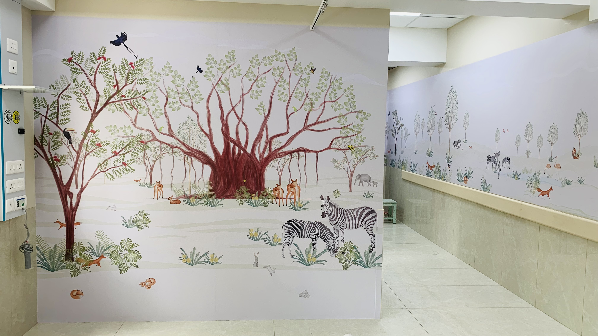
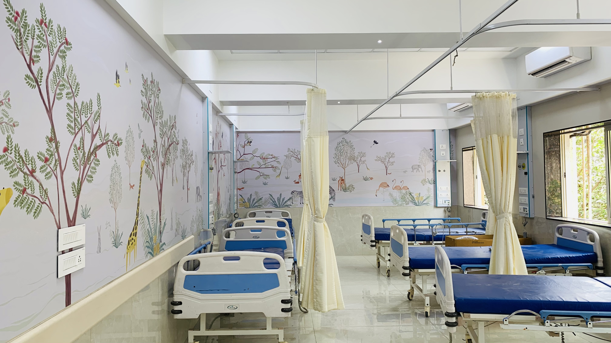

# About me

Hey! I am Maithili, welcome to my archive of explorations!&#x20;

I am from Mumbai, India and that's where I have spent most of my life. Though I have travelled a fair bit, this is my first time living away from home for longer than a month, but Barcelona is growing on me very fast haha :)

On a personal front, I love to draw, listen to music (a sucker for Indian classical music), travel and drink tea. I have a _Visharad_ degree in an Indian classical dance form called _Bharatnatyam._ One day, I would love to have my own farm with rescue animals and a nice little farmhouse!

<figure><figcaption></figcaption></figure> <figure><figcaption></figcaption></figure>

So far, I have had the privilege of rescuing and fostering animals, and I think that has contributed significantly in my aspirations, not only personally but also professionally.

<figure><figcaption>
Shifu
</figcaption></figure> <figure><figcaption>
Limlet
</figcaption></figure> <figure><figcaption>
Rolly and Polly
</figcaption></figure>

**Professionally**, I am an architect and storyboard artist. I have my studio and practice based in Mumbai since the past four years. I have worked on a variety of projects including architecture, interior design, furniture design, murals and storyboards. Having my practice in Mumbai, one of the densest cities in the world, informed the way I approached my design projects. Maximizing the functionality of a small space became priority, be it a home, a piece of furniture or an object. My Instagram is a space of documentation for some selected works. You can check it out below!&#x20;



Apart from this, you can also find my portfolio attached below! Feel free to take a look :)



Another project, that's very close to my heart is a mural project I worked on for the pediatrics ward at Masina Hospital in Mumbai. The process started with ideation on paper, designing individual animal characters, illustrating every element and character on ‘Procreate’, editing and putting it together on Photoshop to create a narrative. What started as a simple straightforward brief snowballed into a multitude of design iterations, tasks, huge file sizes that our computers couldn’t handle, all with a fast-approaching deadline. With full time jobs on the side, it became difficult for us to manage everything and deliver on time. At this point in the project, our friends stepped in and came onboard to lend their expertise for specific issues. Few architect colleagues, took on the task of creating individual illustrations so we could focus on the bigger picture. A software engineer helped us find ingenious ways to reduce file sizes and provided technical support throughout. One person who could only help out from a distance, managed our final prints and coordinated with the print shop. Others, hung around to provide encouragement and beverages as required. For a month, our team included of architects, graphic designers, software engineers, print shop employees to lastly wallpaper installers on site. We encountered multiple challenges along the way but the project turned out to be huge success and was executed on site well in time. Today, the murals adorn the walls of the Children’s ward, hopefully bringing an occasional smile to the little patients.&#x20;

<figure><figcaption></figcaption></figure>

This project made me realise the importance of two things – contributing to a cause that makes the world a slightly better place and the potential of collaboration. Though the scale and scope of this project was different from the work that I have done in my practice, it allowed me to experience the collective energy that I am now actively seeking in all my projects.&#x20;

<mark style="color:yellow;">**And this collaboration is what lead me to choose MDEF!**</mark>

<figure><figcaption></figcaption></figure> <figure><figcaption></figcaption></figure>

