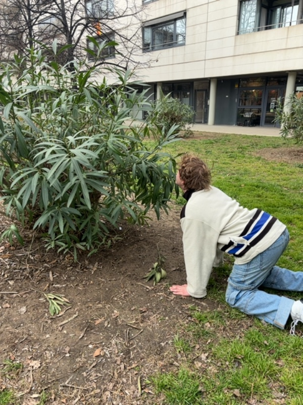
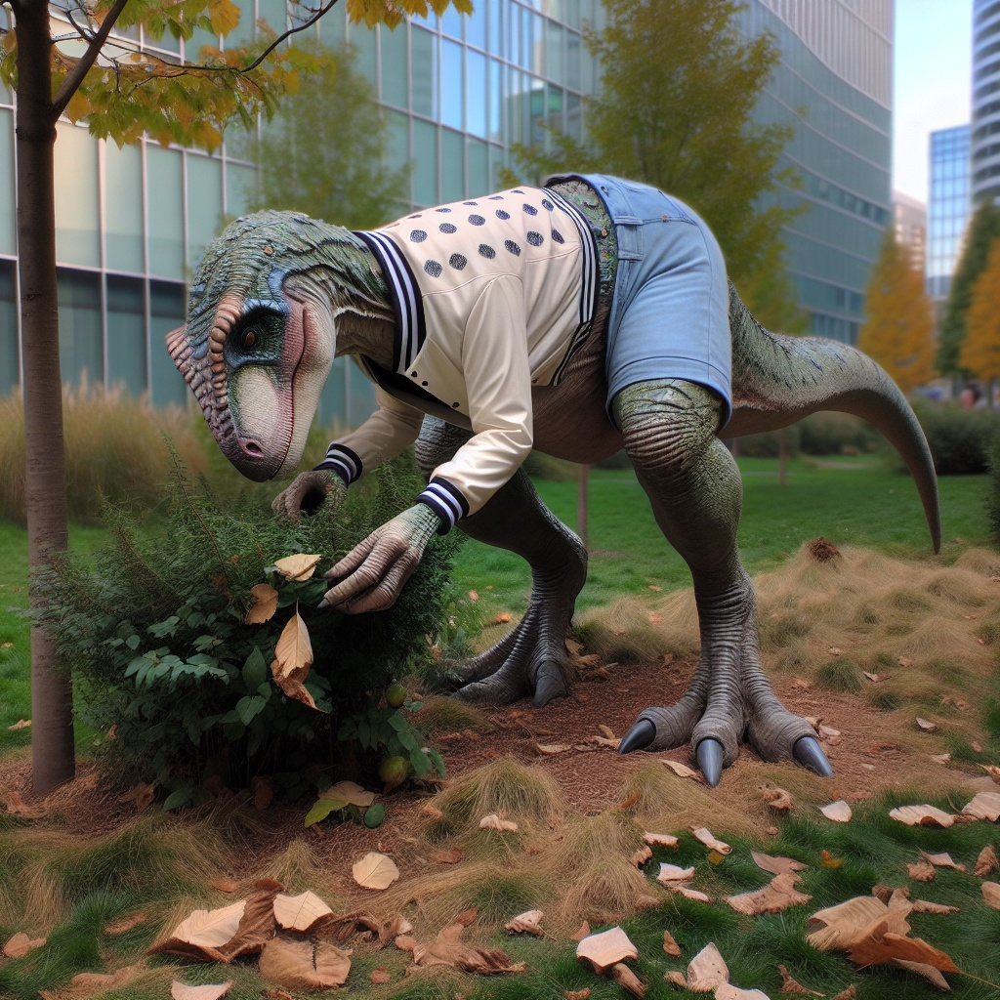
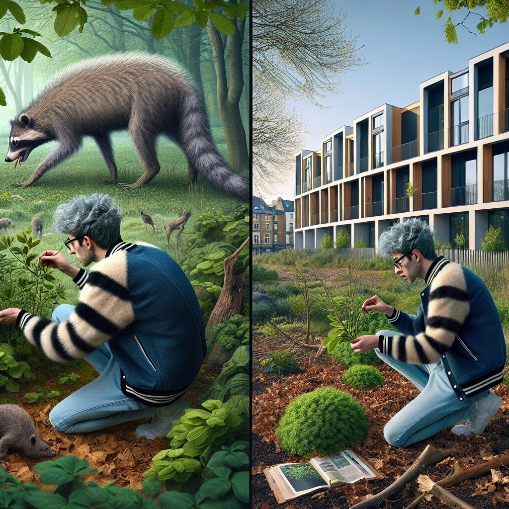
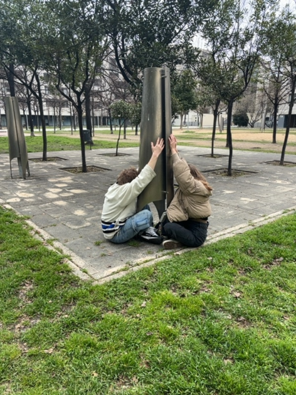
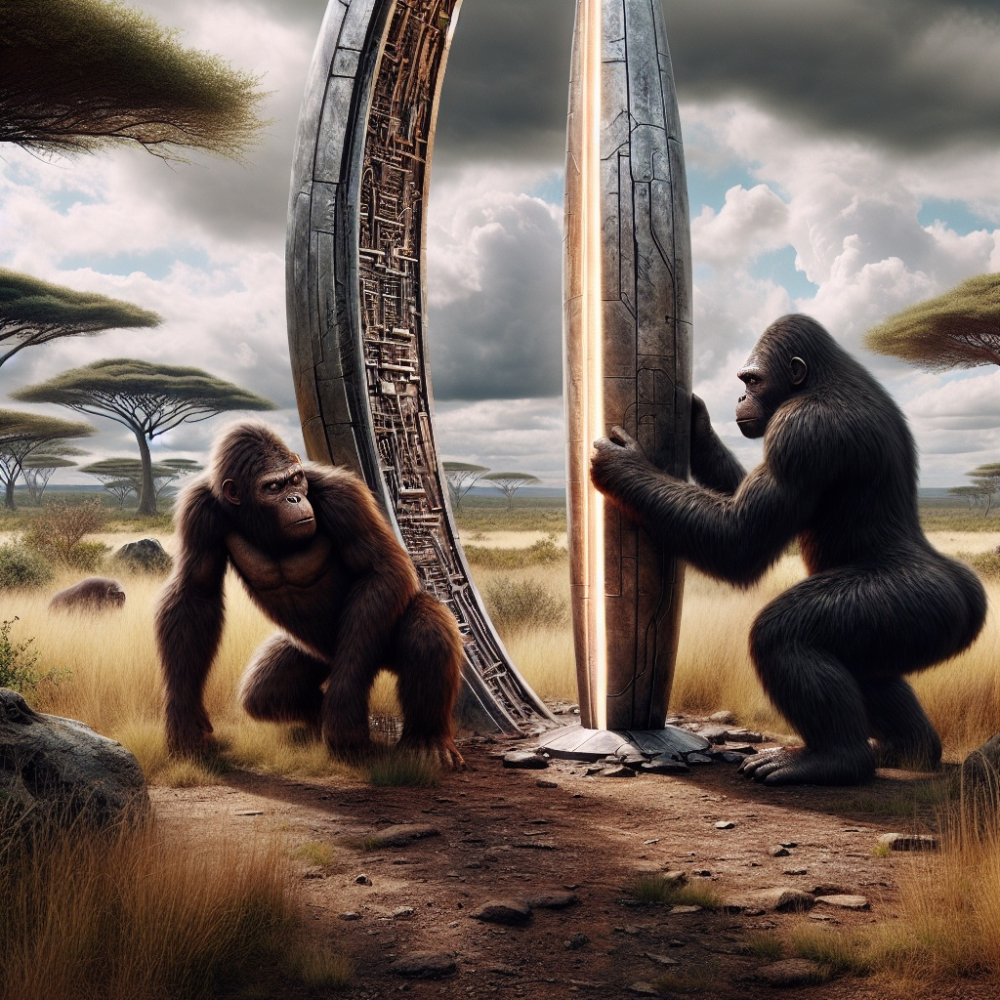
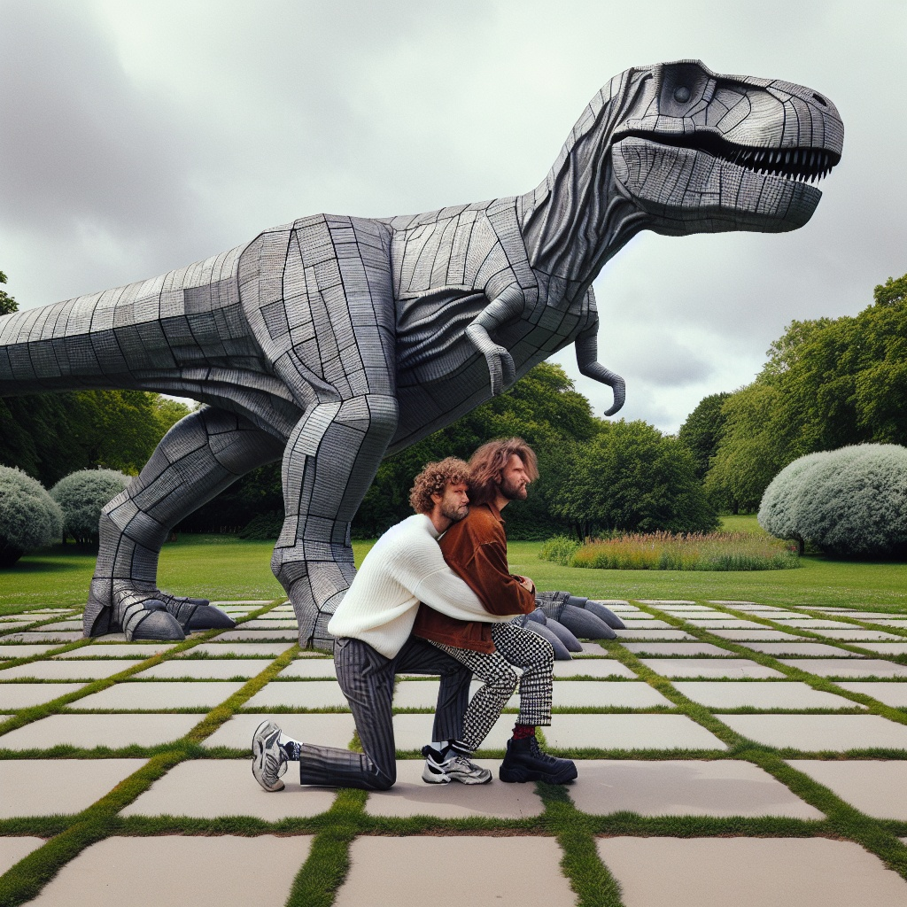
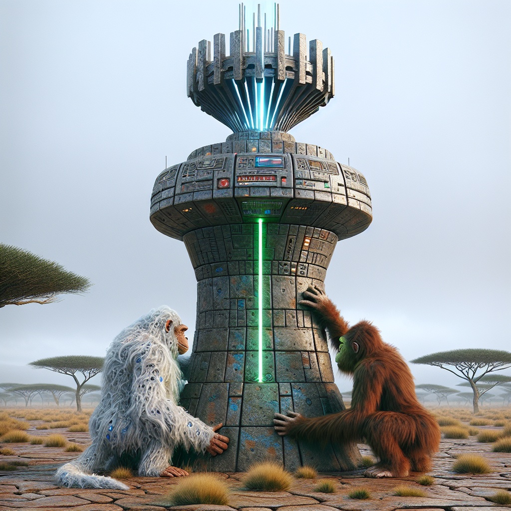

# Extended Intelligences II

Faculty : Pietro Rustici, Christopher Ernst&#x20;

***

### Day 01 : Dottod AI Camera&#x20;

The first day of the course started with an introduction to a tool developed by Dottod, AI Camera. We split up into groups and walked around IAAC, to click some pictures within a theme that we decided upon as a group. The way the tool works is you use your camera through the AI, which masks the photo once clicked, but generates a description. Then, based on the prompt that you give, the description is modified and an image is generated.&#x20;

As a group, we focused on a larger theme of 'in the wild'. Once back in class, we tried to generate images based on similar prompts but we ended getting really diverse results based on the original photos. We tried using different prompts with varying levels of detail, but the outputs were erratic.&#x20;

<figure><figcaption>
Original Picture
</figcaption></figure> <figure><figcaption>
Prompt 2
</figcaption></figure> <figure><figcaption>
Prompt 1
</figcaption></figure>

Prompt 1 : an image of a wild creature trying to feed itself with leaves in a forest.

Prompt 2 : an image of a wild dino human creature trying to feed itself with leaves in a forest.

This particular image gave us the best results in terms of what we were expecting. Though, in terms of using the AI, we had a bias about the result which we wanted to achieve, that got me thinking about whether this is the best way to approach an AI? Should we manipulate the result by changing the prompt or should we define the prompt and surrender to the result? Maybe surrender is a big word, but its the thought that counts.&#x20;

Many other attempts that we tried generated weird results.&#x20;

<figure><figcaption>
Original Picture 
</figcaption></figure> <figure><figcaption></figcaption></figure> <figure><figcaption></figcaption></figure> <figure><figcaption></figcaption></figure>

### Day 02 : Modmatrix

On the second day, we were introduced to another tool called Modmatrix, that had multiple options for input and output. The inputs could be text or image, which is then modified by a prompt, and the result could be text, an image, or even a CAD model. Initially, I was super fascinated by the possibility of getting a  3D model generated from text. I tried to use the Ai using both inputs, giving direct and specific prompts. The outputs were everything except the model. I tried multiple prompts, simplifying them with each attempt, but somehow it didnt work. I understand, the tool is a work in progress but maybe having some specifications about engaging with it could help the user navigate it better.&#x20;

### Day 03 : Project&#x20;

The second day ended with splitting up into groups of two or three to conceptualize and execute a project in less than two days. I teamed up with Paula and Vitti to explore something with materials. After ideating with Paula, we decided to make an AI that would combine properties of existing materials and inspirations from biology to generate speculative biomaterials. As a second step to this, we wanted to have a dialogue with the generated material in some way. However, after discussing with Pietro and Chris, we realised that in order to include the hardware component in the project and considering the timeline, we settled on simplifying the idea. We decided to use a pressure sensor as a way to generate the materials. The way we executed this was by assigning prompts to different ranges of pressure values, so depending on the pressure applied - the material generated would have different properties. The output was a text description of the material that we fed into ChatGPT to generate an image. The ideal scenario would have been to integrate ChatGPT directly , but due to time constraints and lack of our expertise in coding, we added the manual step of taking the description and asking chat to generate the image for us.&#x20;

<figure><figcaption></figcaption></figure> <figure><figcaption></figcaption></figure> <figure><figcaption></figcaption></figure>

<figure><figcaption></figcaption></figure> <figure><figcaption></figcaption></figure> <figure><figcaption></figcaption></figure>


Demo&#x20;


Some speculative materials that were generated were absolutely on point to the prompts that we had assigned. Sharing the final code here -



This course compared to the previous one was much more grounded and practical about the use and potential of AI. We had the chance to experiment hands on and engage with tools even if it was quick. The projects shared by Pietro and Chris were a really good example of using AI, almost in a humble way. This course for me was almost like an ice breaker in terms of using Ai, without feeling dauntedby it. To consider its potential if used within the appropriate frameworks, and to burst the bubble of AI, like an all knowing entity. In contrast with the previous term where we explore the theory and ethical implications, climate impact of AI as an industry, this was a fresh and optimistic perspective about the same. Engaging with the tools and working on the small project had made me curious about exploring it further, understanding its potential without feeling terrified about it taking over the world and hopefully making use of it in my professional future.

