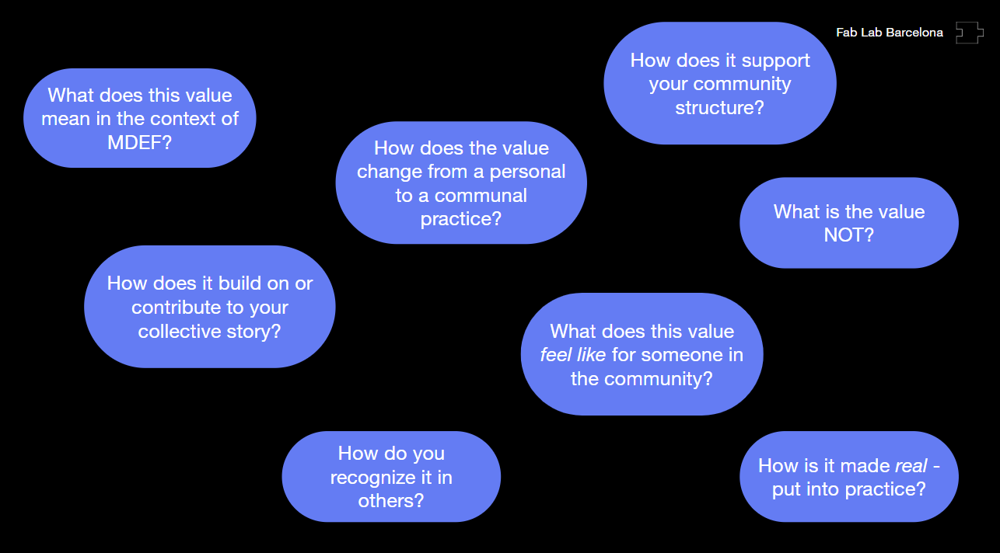

# Agriculture Zero

Faculty : Jonathan Minchin&#x20;

***

This course provided a quick yet insightful introduction to the world of agriculture, biological systems, ecology, and how we as humans fit into the picture. It was brief but definitely made me curious about the systems and techniques we discussed.&#x20;

On the first day, we covered fundamental concepts about forests and natural ecosystems. We also received a variety of reading materials and took part in a brief tour to explore the urban gardens in the Poblenou neighborhood.

<figure><figcaption></figcaption></figure>

The most interesting part of the seminar was the field trip to Valldaura labs, where we went for a day . On the way there, we came across a variety of plants and Jonathan gave us information and fun facts about everything we stumbled upon on the way. It was an interesting exercise and felt so good to get away from our classroom for a lecture! We also used the iNaturalist app to identify species of plants, fungi amongst other things.&#x20;

<figure><figcaption></figcaption></figure> <figure><figcaption></figcaption></figure> <figure><figcaption></figcaption></figure>

<figure><figcaption></figcaption></figure>

Once we went to Valldaura, we learnt about the way they grow their crops, the permaculture they use, their greenhouse, and soil less systems they use.&#x20;

<figure><figcaption></figcaption></figure> <figure><figcaption></figcaption></figure>

<figure><figcaption></figcaption></figure>

## Assignment : Hack-ing Farm-ing

As part of the adventure, we were tasked with finding a site, any site to pick and _hack,_ and be able to deliver a system that would work for the betterment of the same. While wanting to go traditional at first, the team comprising of Flavio ,Mohit and me, decided to go in a different, more vertical direction; both literally and metaphorically. We came to a consensus of trying to find a site that is super evident and accessible to most of us (at least here in Barcelona), and _generalize_ the solution. So, we decided to take a walk and landed up on the roof, ergo, terrace, which became our site (IAAC rooftop for the versed and a(ny) balcony for the unversed. And there goes the proposal:

### Outdoor Aeroponic Farm with Sound Wave Technology:

We wanted to propose something that was accessible, immediate but _emergent_ enough \*\*for it to take shape anywhere and everywhere: from the largest rooftops to the smallest balcony. Our version of the **Aeroponic Farm** works like a **drum**. The Soundwave technology connects at the top and the bottom of the farming system and works on two levels:

* The bottom level leverages recycled kitchen greywater into an eco-friendly filtration system, helping nurture the growth of the plants while deterring any pests creeping from the bottom,
* The top level functions as the pest deterrent and _vibrates_ off anything that doesn’t belong in the system from the top down, for better care for the plants

This proposal highlights the efficacy of a sustainable and innovative aeroponic farm system designed for “urban” balconies, addressing the challenges of limited space, water scarcity, and chemical-free pest management.

<figure><figcaption></figcaption></figure> <figure><figcaption></figcaption></figure>

Design Elements:

1. **Framework:**
   1. **Structure:** A vertical aeroponic structure with multiple tiers suitable for a standard balcony, optimizing sunlight exposure made using lightweight, durable and weather-resistant material like aluminum or recycled PVC
   2. **Aeroponic Root Chambers:** Enclosed chambers for roots to grow in misted air, ensuring aeration and nutrient uptake
   3. **Nutritive Additives:** Natural nutrients can be periodically added to the water tank to enhance plant growth
   4. **Plant Varieties:** Leafy greens, herbs, and compact fruiting plants (e.g., strawberries, cherry tomatoes)
2. **Greywater Recycling:** Collection of kitchen generated greywater via the sink connected to the balcony/terrace with a small pipeline
3. **Filtration System:**
   1. **Primary:** Coco peat and natural fibers (e.g., jute or hemp) for removing debris and oils
   2. **Secondary:** Activated charcoal and sand layers to purify the water further
   3. **Extra (Tertiary):** UV sterilization for microbial safety
4. **Bottom Drum Soundwave Irrigation:** Ultrasonic sound waves generate a fine water mist to directly hydrate the exposed plant roots without excess water wastage along with an added option to adjust frequency for achieving **optimal misting levels** and monitor based on the plant type and growth stage
5. **Top Drum Chemical-free Pest control:** Non-invasive i.e. safe for pets and humans, High-frequency sound waves with **tunable settings** for customization (as per specific needs) to deter pests like aphids, spider mites, and caterpillars, among others
6. **Automation and Monitoring:**
   1. **IoT Integration:** A Smartphone app to detect sensors that monitor moisture levels, pH, and water quality and sends regular notifications
   2. **Energy Efficiency:** Solar panels (optional) could be utilized instead of traditional electricity means to power the pump and sound wave generators
7. **Environmental and Social Benefits:**
   1. **Water Conservation:** Greywater recycling helping reduce fresh water usage
   2. **Chemical-free Farming:** Avoiding the use of pesticides and fertilizers to ensure _natural_ growth and safer produce
   3. **Urban Greening:** Encouraging _urban_ people to grow their own food, while helping the immediate context by reducing urban heat islands and enhancing air quality

**This version of the aeroponic farm system, in our opinion, helps integrate&#x20;**_**emergent**_**&#x20;technology and making it accessible to the masses while helping developing a community of&#x20;**_**urban**_**&#x20;people working, farming and cohabiting the greens together (but from their private balconies/rooftops).**

