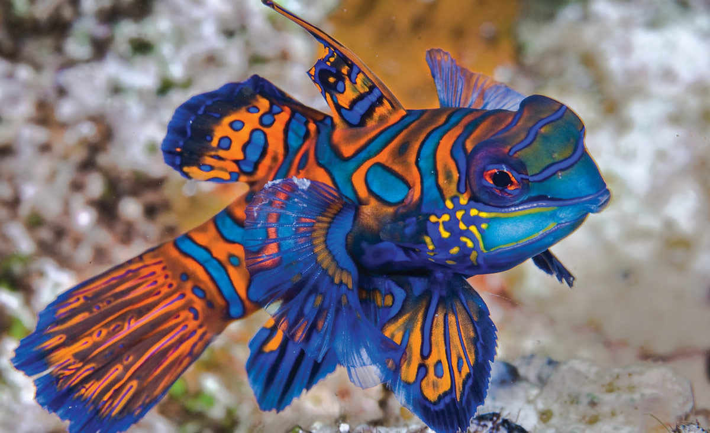
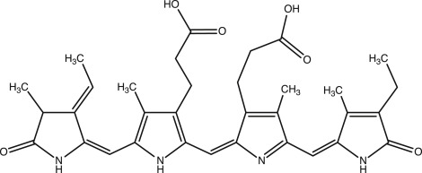

# Biology Zero

Faculty : Nuria Conde

***

This seminar seemed to be the most exciting seminar so far, and we did do some hands on stuff that I expected. Nuria started the week with a introduction to science, relearning basic concepts that all of us learnt way back in school - chemistry, biology, physics. Though, most of it I had forgotten, I enjoyed the nostalgia. She then went on to present some hard hitting facts about the climate crisis and left us all feeling helpless. But oh well, that has been a theme through the entire term so were learning to cope with it.&#x20;

She then introduced the exercise where she gave us 'recipes' to grow living organisms on. Each group picked one recipe to grow their own colonies of bacteria, which was pretty cool.  She taught us the codes of working in lab, protocols of maintaining a sterile and controlled environment while performing experiments.&#x20;

Our group did the recipe to grow lactobacillus with milk. We curdled boiling milk with lemon juice and agar, then sterilized the bottle and poured the concoction into multiple petri dishes. We let the petri dishes rest for a day, and then contaminated them with anything that we wanted and people went crazy. Food items, sawdust, pencil shavings, nails, and also last but not the least bodily fluids were used as contaminants. And after 48 hours, some petri dishes showed visible colonies!&#x20;

<figure><figcaption></figcaption></figure> <figure><figcaption></figcaption></figure> <figure><figcaption>
Spot the colonies!
</figcaption></figure>

<figure><figcaption></figcaption></figure>

The second day went into exploring lab equipments, specifically microscopes. We got to explore a variety of samples under three different types of microscopes and it was a fun experience.&#x20;

<figure><figcaption></figcaption></figure> <figure><figcaption></figcaption></figure>

For the third and final day, Nuria delved into some details of biology and synthetic biology. She explained the process of making a genetically modified organism, the technologies that the scientific community has used and shared some resources for open source scientific papers. The discussion pivoted to the ethics of synthetic biology and the parameters of pushing the boundaries of what can be achieved using science.&#x20;

We ended the day by discussing about semolina and its properties of being a super food. Nuria shared some insights about the process of growing semolina and some of its prerequisites. We then had a chance to taste some semolina with a nice slice of bread and some semolina chocolates! Definitely felt skeptical about eating some really green stuff, but it was pretty good!

<figure><figcaption>
Semolina spread with bread
</figcaption></figure> <figure><figcaption>
Semolina chocolates 
</figcaption></figure>

## The GMO Proposal

For the exercise, we had to give a proposal for a GMO, with a concept, the technology and the host organism.&#x20;

<figure><figcaption></figcaption></figure>

Concept&#x20;

True blue pigments are extremely rare in nature due to the challenges of producing blue coloration at the molecular level. Most blue appearances in plants and animals are caused by structural coloration rather than pigments. The flora and fauna found in nature that have the blue pigment are extremely rare. Some of the examples are below -&#x20;

1.  **Blue Poison Dart Frog (Dendrobates tinctorius 'azureus')**

    * **Habitat:** Rainforests of South America.
    * **Coloration:** Structural coloration combined with pigments.
    * **Purpose:** Warning coloration to deter predators.

2.  **Mandarin Fish (Synchiropus splendidus)**

    * **Habitat:** Pacific Ocean coral reefs.
    * **Coloration:** True pigment-based blue coloration, one of the rare animals with actual blue pigments.
    * **Purpose:** Mate attraction and territorial displays

3. **Butterfly Pea Flower (Clitoria ternatea)**
   * **Habitat:** Tropical Asia.
   * **Pigment:** Anthocyanins.

The true blue is one of th emost vibrant colours available in nature and it would be great if one could extract the pigments for a variety of reasons like cloth dyeing, cosmetics, organic paints wtc. I understand that indigo is already available,  but it would be great if we could make a GMO that produces a vibrant blue pigment which once extracted, retains its vibrancy and longevity. Most indigo pigments are not holdfast when used for dyeing.&#x20;

The intention is to develop a GMO that naturally produces the blue pigment in plant leaves which can be extracted while retaining its vibrancy and hold fastness. It can be then used to create multiple organic ways of dyeing, making paints and cosmetics and can prove to an alternative to synthetic dyes.

#### **Introduction**

\
This proposal outlines the development of a genetically modified (GMO) plant capable of producing a naturally occurring rare blue pigment. The pigment, derived from organisms such as cyanobacteria, will be incorporated into a plant species to enable sustainable and eco-friendly extraction for applications in textile dyeing, natural paints, cosmetics, and more.

**Pigment Selection**

* **Candidate Pigment:** Phycocyanin
* **Source:** Naturally found in cyanobacteria (e.g., Spirulina) and certain algae.
* **Key Properties:** Water-soluble, biodegradable, and safe for human use, making it ideal for textiles, paints, and cosmetics.

<figure><figcaption></figcaption></figure>

**Host Plant Selection**

* **Tobacco (Nicotiana tabacum):** Highly amenable to genetic modifications and fast-growing.

**Gene Identification and Isolation:**

Isolate genes responsible for phycocyanin production, such as **cpcA** and **cpcB**. This gene would be inserted into the tobacco plant using CRISPR-Cas9, and it would also have to ensured that the conditions are conducive so the phycocyanin can synthesized and eventually extracted.

While existing plants can be used to extract natural blue pigments, their limitations in stability and vibrancy highlight the potential for **genetically modified plants** to overcome these challenges. By introducing genes for durable pigments like **phycocyanin** into fast-growing plants, we can create sustainable, high-yield sources of vibrant blue pigments for textiles, cosmetics, and other industries.

References&#x20;



