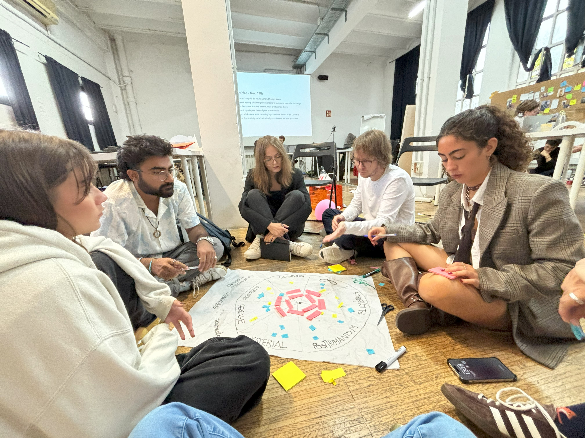

# Design Studio&#x20;

Faculty : Guillem Campradon, Laura Benitez, Saul Baeza, Roger Guilemany, Jana Tothill

***

### Design Space 01

<figure><figcaption>
Design Space : Initial Exploration
</figcaption></figure>

### Design Space 02

<figure><figcaption>
Design Space Development 
</figcaption></figure>

### **Reflection 01**&#x20;

My thoughts and learnings about the studio so far!&#x20;



***

## Prototyping Exercise

We spent an afternoon working in small groups, discussing the roles of prototyping as part of our design space. Flavio, Lucretia and I took turns discussing about our previous experiences in prototyping and identifying which category our experience fits into.&#x20;

<figure><figcaption></figcaption></figure>

After an in-depth dialogue about each others previous prototyping experiences, we had to trade off reimagining ways of prototyping each other's experience but using a different  role. I worked with Flavio's experience. During one of his projects, he designed a kitchen interior by taking inspiration from the naturally occurring hexagon formation of basalt. Apart from using basalt as the material for the kitchen counter, he used hexagonal modules so it could be replicated and interlocked. I decided to work with his idea of modularity and incorporate it in context of multifunctionality. Keeping in mind the context in my hometown Mumbai, I have worked on homes with tiny footprints. Modular furniture plays a key role in ensuring that small homes are functional without compromising the design. I designed a prototype for an extendable counter top, which could be used if need arises for a bigger worktop. It also could be used vertically for different purposes.&#x20;

Making this quick prototype was an interesting way to visualize initial ideas which can be refined based on the requirements of different kinds of projects.

<figure><figcaption></figcaption></figure> <figure><figcaption></figcaption></figure>

### Reflection 02&#x20;

The past two weeks have been very intense with [Machine Paradox](machine-paradox.md) and [Living you your own ideas](living-with-your-own-ideas.md), I did feel like I couldn't update the design space much. Having said that, I did add an important reference which gave direction to my design intervention.&#x20;



***

## Collective Design Space

<figure><figcaption></figcaption></figure>

<figure><figcaption></figcaption></figure>

<figure><figcaption></figcaption></figure>

### Design Space 03

<figure><figcaption></figcaption></figure>

### Design Space 04

<figure><figcaption></figcaption></figure>

