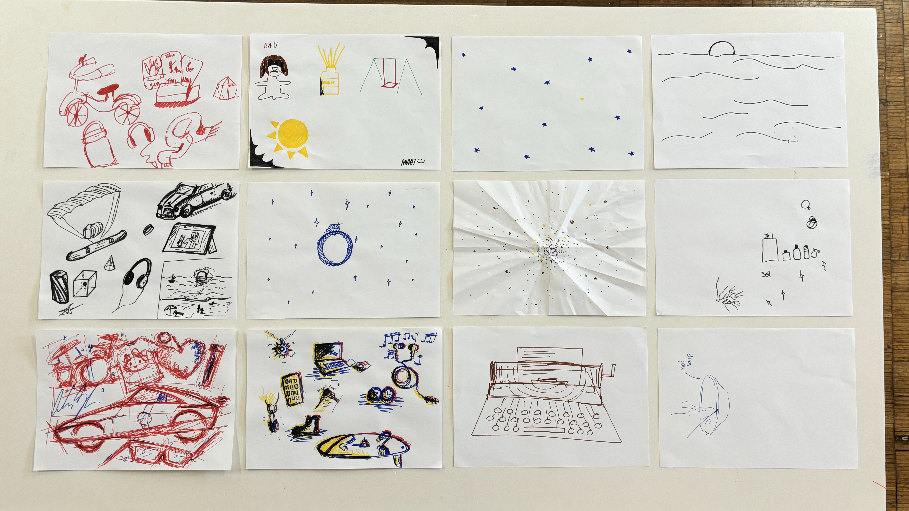

# Collective Design Intervention 02

Group : Lucretia, David, Maithili

***


What is the relationship people have with objects?&#x20;


Lucretia, David and I decided to join forces to do the second group intervention. Our areas of interest were fairly along the same lines with different approaches. The key question that all of were asking though was what is it that people value and why? What is the relationship people have with objects. We went through an intense process of brainstorming where we came with multiple ideas which made sense for us to explore.&#x20;

1. Our \[\_] Museum

We started question the idea of the museum and how objects have value after they are placed on a pedestal. Its interesting how museums have a peculiar context of displaying objects out of their contexts and yet managing to make it invaluable. We wanted to explore the idea of flipping the narrative of the museum over its head, by letting people decide what objects should be displayed in the museum. We designed stickers which looked like blank museum plaques which people to fill in. The idea was these stickers would be distributed and people could have them on any object - personal, owned, communal, public -  that they thought should be displayed in a museum that would no longer be one space, but a distributed network around the city. Each 'artefact' would have a picture taken and uploaded on an online archive. Though it would have been great to explore this idea, during the process we lost track of the original intent and logistically it became difficult to build the alive archive within our time constraint.   &#x20;

<figure><figcaption></figcaption></figure>
