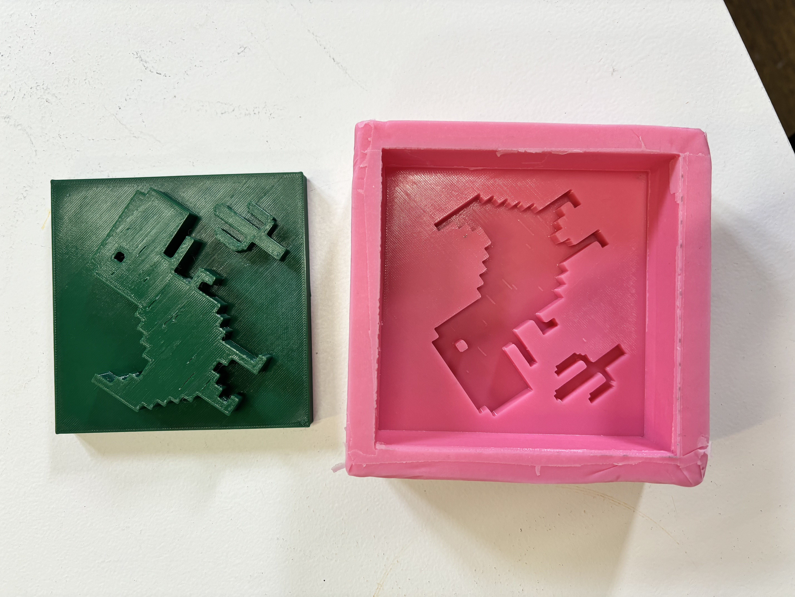

# Digital Fabrication

So far, we have learnt how laser cutting, 3D printing, CNC Milling and Arduino works, in theory with limited hands on experience. The intention is to lose the fear of machines and use them as important part of the prototyping process. I previously have some experince with woodworking and lasercutting, but 3

<figure><figcaption></figcaption></figure>

<figure><figcaption></figcaption></figure> <figure><figcaption></figcaption></figure> <figure><figcaption></figcaption></figure>

