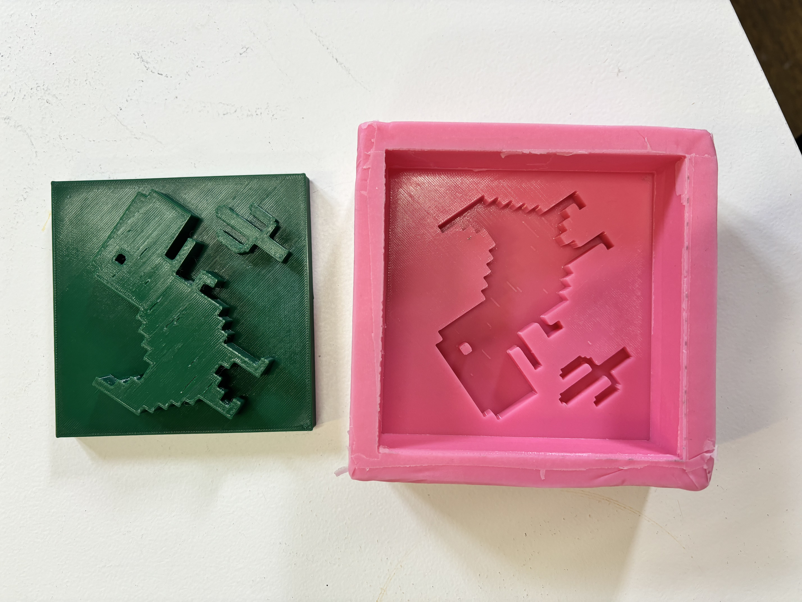
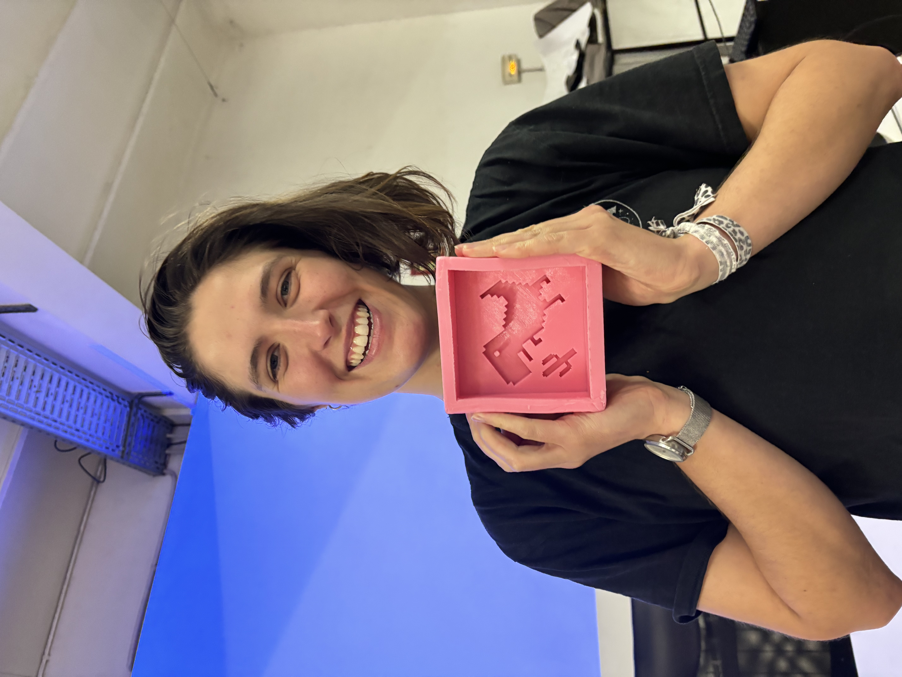

# Digital Fabrication

***

So far, we have learnt how laser cutting, 3D printing, CNC Milling and Arduino works, more in theory with limited hands on experience. The intention is to lose the fear of machines and use them as important part of the prototyping process. I previously have some experince with woodworking and lasercutting, but 3D printing and CNC Milling are super new and daunting,  I admit. I am hoping that as the year progresses, I will become comfortable with using these machines and explore their potential.&#x20;

As a fun exercise, we are building a pixel wall as a class. We made groups of two and each group had to design a 10cm x 10cm tile which we could cast. Lucretia and I decided to make the internet dinosaur because its very cute! We 3D printed the tile, and then used silicon to make the mould. We will now be casting it either using concrete or plaster of paris, maybe even some biomaterials!

More updates after we cast....

<figure><figcaption></figcaption></figure>

<figure><figcaption></figcaption></figure> <figure><figcaption></figcaption></figure> <figure><figcaption></figcaption></figure>

