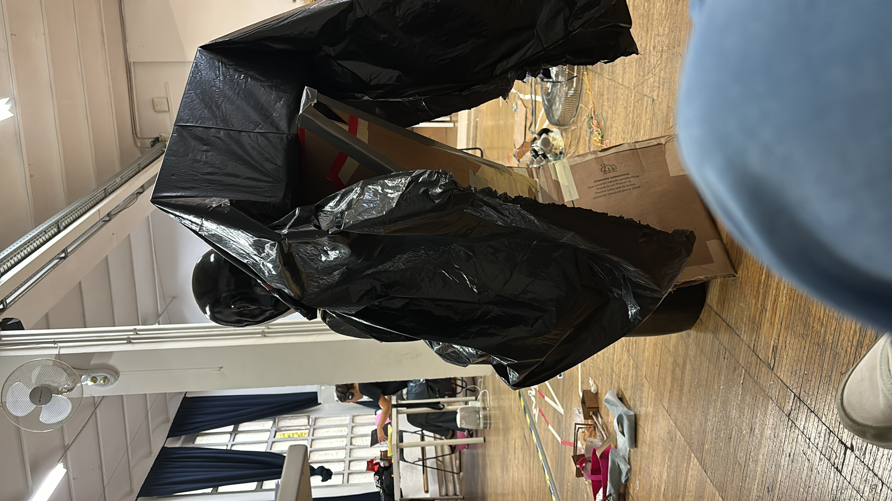
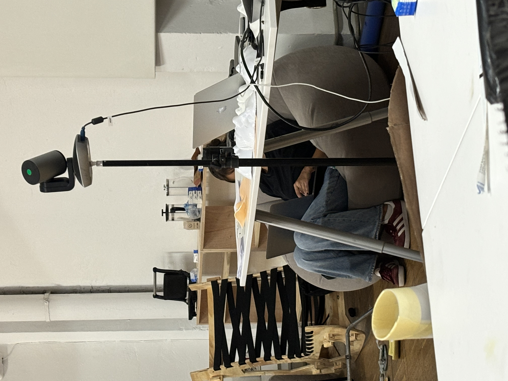

# Living with your own ideas

Faculty : Saul Baeza

***

## Day 1 : Becoming the best version of myself

The first day started with Saul explaining the week long exercise. We discussed in class about what it means to have a prostheses and what counts as in. Medical devices, make up, clothes, accessories? Or is it concepts - like societal standards ? We are all putting on a variety of prostheses, both tangible and intangible throughout the day to 'perform'.&#x20;

The first prompt was making a prosthesis about becoming the best version of myself. Upon contemplating what that means for me, I realized the one thing I would like to modify about myself is the fact that I have to wear glasses to correct my vision. What if glasses could be more than just correcting vision? What if I could manually focus on things that I am interested in?&#x20;

Imagine this :&#x20;

Youre living in the hustle and bustle of the city, with traffic and a rush to get somewhere. You wake up ever morning, with a clear routine in mind, getting ready and going to work. There's an urgency to reach places on time and you forget to take a pause. Nature is but a background in your daily life and you forget to acknowledge that you could also engage with it.&#x20;

But, you now have your binocular glasses and things start to change. You can now focus on things you normally wouldn't focus on. Like trees, leaves, clouds, birds in the sky. On your commute, you can adjust your focus and take a closer look at the finer things in life. Suddenly, your life is filled with little moments that allow you to engage with nature.

<figure><figcaption>
Binocular Glasses 
</figcaption></figure>

<figure><figcaption>
Front Elevation
</figcaption></figure>

 

<figure><figcaption>
Side Elevation
</figcaption></figure>

Its interesting to think how our daily prosthesis have the potential to be so much more. Reimagining our daily use case could extend our abilities as humans. I believe becoming the best version of myself would be using my weakness as an opportunity to explore things that could potentially become my strengths.&#x20;


&#x20;




## Day 2 : Becoming someone else&#x20;

The second day began with an amazing interaction with Thomas Thwaites where he shared some projects. The projects included the making of a toaster and exploring the idea of being more than human - a goat. He explained his inspirations, motivations behind the projects and the intensity of its process. One thing that both his projects had in common was the steadfast commitment during the process and being okay with uncomfortable situations that come up when you explore things in the first person perspective. Following the talk, we collectively read an excerpt from Thomas Thwaites' book about his project 'Goatman' and from Donna Haraway's 'The Companion Species Manifesto'. The readings became food for thought for our prompt that followed.&#x20;

The second prompt for a prosthesis was becoming someone else. It could be interpreted in multiple ways but the intention was to become non-human. Taking inspiration from nature and the chameleon, I used the colour changing ability to be used in my prosthesis. How would it be if we could have the ability to emote without speaking? Would it make having vulnerable conversations easier? Would wearing something that reflects your true feelings create safer spaces and a world without judgments?&#x20;



The prosthesis is a second skin which can be worn as a sleeve. The sleeve would simulate colours that are associated with different emotions to indicate my state of mind. This prostheses would be a part of a network of similar prostheses worn by other people. Apart from indicating my own feelings, it would also make it easier to assess other people's emotions and ease conversations, especially in new contexts.&#x20;

Reflecting on my own transition from India to Barcelona a month back, the process of getting acquainted will a completely new set of people is nerve wracking. It takes time to for people to move past the ice breaking stage and form meaningful friendships. I would like to believe that having this prosthesis would have eased the transition.   &#x20;

<figure><figcaption></figcaption></figure>

 

<figure><figcaption></figcaption></figure>

This is imagined as a prototype but could also come in different versions, some more discreet than others.&#x20;



## Day 3 : To judge / To be judged | The Double Game&#x20;

On the third day, after a collective discussion about previous prosthesis, we delved into a reading by Sophie Calle. It was about her experience of hiring a detective for herself, without the detective knowing. She then curates the way she is judged by the detective i.e 'him' as an experiment, eventually comparing her notes to the detective's highlighting the difference between perceptions.

#### As the Subject

While being the subject, we were asked to introspect and design a prosthetic that would define the way we would be perceived by the detective. When tasked with introspection, we were challenged to design a prosthetic that would influence the detective’s perception of us. After some thought, I aimed to be seen as someone who effectively sets healthy boundaries, adaptable to situations and people. This prosthetic embodies 'soft armor,' expanding and contracting to safeguard my mental well being.

<figure><figcaption></figcaption></figure>

 

<figure><figcaption></figcaption></figure>

<figure><figcaption></figcaption></figure>

#### As the Detective

As Vitti's detective, I was focused on understanding her intentions behind her actions. I documented her through pictures and notes.

3.40 pm

<figure><figcaption></figcaption></figure>

Vitti stayed in class, while everyone else left. She was wearing a black tshirt, blue jeans and really nice shade of red adidas shoes. She put her headphones on and was typing on her laptop at her desk. She is focused on what she’s doing .

&#x20;

3.49 pm

<figure><figcaption></figcaption></figure>

She shifted from her desk to the more comfortable bean bag. Looks like she is still working and has her headphones on. She is intently typing on her keyboard.

&#x20;

(I am trying to be nonchalant but I am clearly failing)

&#x20;

4.02 pm

<figure><figcaption></figcaption></figure>

Vitti shifts back to her desk and continues working on her laptop. (I try to change my location to see what she’s working on better) After a few minutes, she calls me and asks me to sit with her. She wants to smoke but cant find her lighter. She assumes Andrea took it and never gave it back. Ramon walks in and Vitti asks him for the lighter. She invites me to accompany her to the terrace for a smoke

(I’m a bad detective, chilling with my own subject, lol)

&#x20;

4.08 pm

<figure><figcaption></figcaption></figure>

She lights up a cigarette and we talk about our brownie experience. We talk about our previous experiences about travelling to Varanasi which leads us to discussing about religion. She tells me she is brought up as Christian but would rather be agnostic. She finds it somewhat twisted that religion is used as a way to make money, playing on the feelings of people. She seems curious about understanding and reading about religion but would rather be free from it.

&#x20;

4.22 pm

<figure><figcaption></figcaption></figure>

We are back in class just as everyone else arrives. I ask her what she has been working on, she tells me she’s working on the report and needs to finish it in time. She tells me she’s planning a graduation party for her cousin and will be flying home this weekend. Then she excuses herself to get back to work just as everyone else arrives to class.

&#x20;

### Reflections&#x20;

The three days of this exercise offered deep insights into the nature of identity, perception, and connection through the lens of prostheses—both tangible and intangible. Each day's explorations have not only prompted creative thinking but also encouraged deeper introspection about how we navigate our daily lives and relationships.

The exercise began with a powerful discussion about the various meanings of prostheses. I found myself reflecting on my reliance on glasses, which symbolize more than just vision correction. Imagining them as tools to focus on the beauty of the world around me transformed my perspective on a perceived limitation. This idea of intentionally redirecting my attention toward the small, often overlooked details of life has the potential to cultivate mindfulness and appreciation for the present moment. It reinforces the notion that our vulnerabilities can be reframed as opportunities for growth, leading us to become the best versions of ourselves.

The interaction with Thomas Thwaites expanded my understanding of what it means to "become someone else." By drawing inspiration from the chameleon, I envisioned a prosthesis that could visually express emotions, thereby enhancing communication and fostering deeper connections. This concept of an emotion-indicating sleeve not only serves the wearer but also helps others navigate social dynamics with greater empathy. Reflecting on my own recent transition from India to Barcelona, I recognized how such a tool could alleviate the anxiety of forming new relationships, making the process of connecting with others more organic and less daunting.

The discussion around Sophie Calle's work and the concept of perception prompted me to consider how I present myself to others. My idea of a "soft armor" prosthetic symbolizes the balance between openness and self-protection. By visually conveying my boundaries and emotional state, this prosthesis embodies adaptability and mental well-being. It’s a poignant reminder of the importance of safeguarding our mental health in a world that often demands constant adjustment.

Through these explorations, I've come to appreciate the potential of prostheses—both literal and metaphorical—to enhance our lives. They serve as tools for self-expression, emotional clarity, and deeper interpersonal connections. This exercise is not just about personal transformation; it’s also about reimagining how we interact with the world and each other. As I continue this working through the year, I look forward to further examining these themes and refining my understanding of what it means to be human in an increasingly complex environment.

