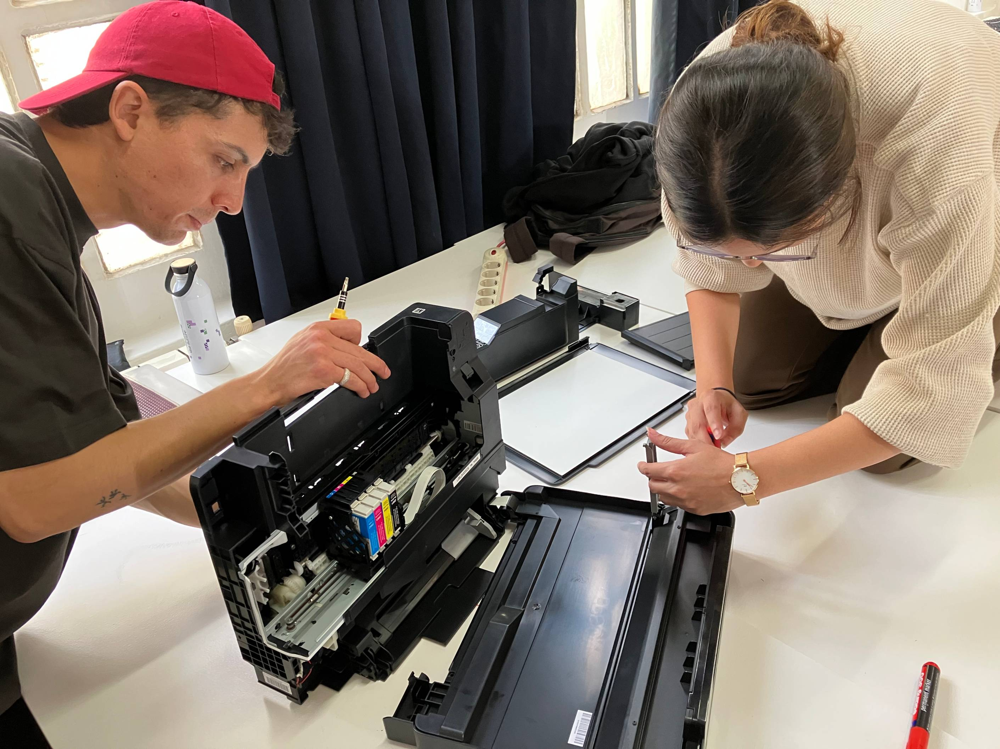
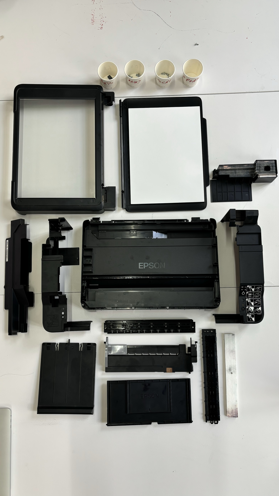
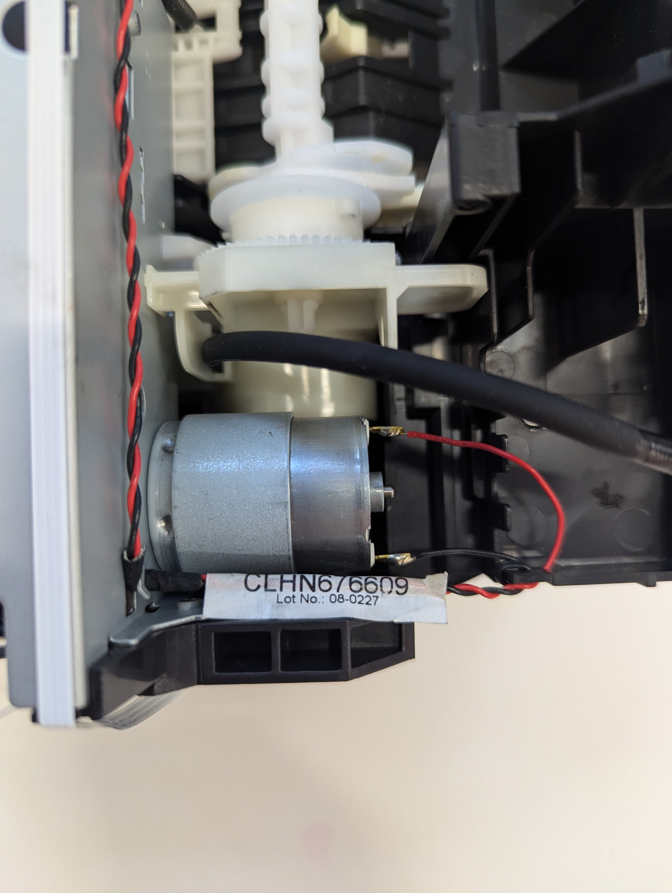
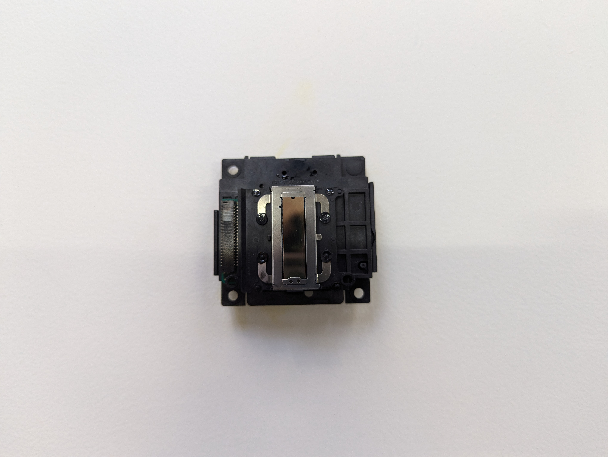
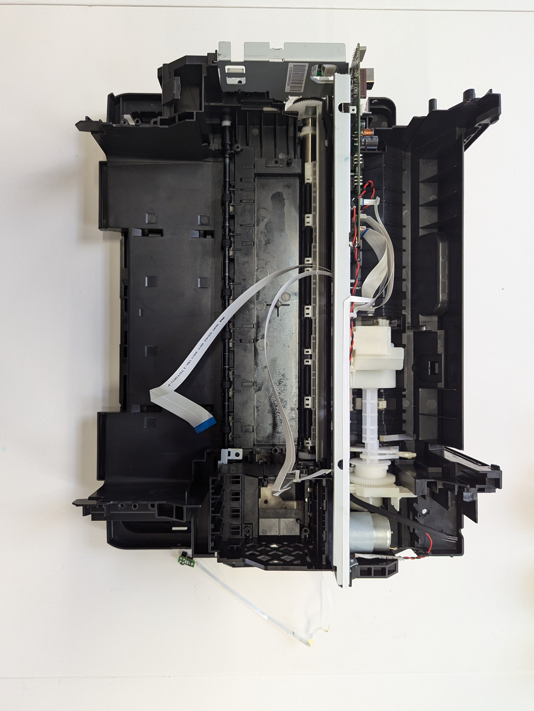

# Machine Paradox

***

<figure><figcaption></figcaption></figure>

<mark style="color:blue;">**The Machine : Epson Printer**</mark>&#x20;

From the pile of broken machines, we selected an Epson Printer. Unpon initial inspection, the printer seemed to be in a good condition. Physically, all of its systems were in place - the scanning system, printing system and the paper system. We tried connecting it to our laptops to check if we could print something. Though it was being detected, we couldn't send any command to print or scan.&#x20;

<mark style="color:blue;">**Disassembly**</mark>

Next step was taking the printer apart. Since it was in a good condition, removing each component was a bit difficult. We started with separating all the components and sorting them based on the systems they belonged to .  &#x20;

<figure><figcaption></figcaption></figure>

1. Printing System&#x20;
2. Scanning System&#x20;
3. Paper System&#x20;
4. Ink Measure System&#x20;
5. Cleaning System&#x20;
6. Control System&#x20;

While doing so , we understood the complexity of the assembly for a simple consumer machine like the printer. The way all of its components interlock with each other with only a few screws indicated that the machine was highly unrepairable and it was designed to be so.&#x20;

<figure><figcaption></figcaption></figure>

 

<figure><figcaption></figcaption></figure>

Making a list of some part which i found really interesting

1. Peristaltic Pump&#x20;

A flexible pipe connected to the ink cartridge that wraps around a wheel. This component is a part of the cleaning system, used when the cleaning command is activated. Leftover ink in the cartridge is deposited in a small tank under it, the peristatic pump using a squeezing motion pulls the ink from the tank and drains it into another component. This small pipe is the crux of the entire cleaning system and applies simple physics to a complex system of mechanisms.&#x20;

<figure><figcaption></figcaption></figure>

 

<figure><figcaption></figcaption></figure>

2. Ink Depositor&#x20;

A tiny metal strip attached below the cartridges, which uses the four colours of ink - Cyan, Magenta, Yellow and Black and mixes them into the desire colours. (I think) Many tiny holes in the strip do the job of depositing the desire coloured ink on paper to print.&#x20;

<figure><figcaption></figcaption></figure>

<mark style="color:blue;">**The Analysis : Forensic Report**</mark>&#x20;

After disassembling all the components , we started to understand the specifications of each component. We tried to understand the serial number, materials, the reasons behind using these materials and any additional information available about the components. We tried to understand the working of each system, Carlos made a super easy to understand visual diagram of all the systems of the printer and how they connect with each other. At the end of the first week, this extensive analysis was compiled into a forensic report and used to archive the information about the original machine.&#x20;



<mark style="color:blue;">**Making of the Almost Useful Machine**</mark>&#x20;

_<mark style="background-color:yellow;">The Beyond</mark>_

_<mark style="background-color:yellow;">A haunted machine that knows it all and answers all your existential questions with absolutely generic answers. As mysticism logic goes, broader the answer, the better!</mark>_



1. <mark style="color:blue;">Process</mark>

In the second week, the second part of the seminar started where we hacked some components of the printer to create an almost useful machine. The most important part of the printer was the cartridge track and the motor which we decided to repurpose. In addition to that, we used a relay and an infrared sensor as key components for our machine.&#x20;

<figure><figcaption></figcaption></figure>

<figure><figcaption></figcaption></figure>

2. <mark style="color:blue;">Prototyping</mark>

Once we had the components in place, the first task was getting the sensor connected to the cartridge track so it could get activated if there was an obstable. We used a relay to control the direction of the movement. With Guillem's help, we were able to get the relay connected between the track and the sensor. We then used Arduino to program the system to respond at the appropriate time&#x20;



Secondly prototype was about programming the track to travel a specified distance once activated. This ensure that once the question was detected by the sensor, a pointer attached to the track would be able to answer. The code initially seemed complex, since we wanted to achieve randomised outputs to the machine would not have a bias. The machine would be able to decide the answer once activated.&#x20;



3. <mark style="color:blue;">The Body</mark>&#x20;

In order to complete the mysticism theatric, the body of the machine was designed accordingly. We used lasercut plywood and spray painted it black to give it the 'look'. Carlos insisted on having some details that would complete the aesthetic, he made sure to lasercut some detailed mysterious symbols that could add some occult element to our machine&#x20;

<figure><figcaption></figcaption></figure>

We complied all of the process information in a presentation below :&#x20;



<mark style="color:blue;">**Reflections and Learnings**</mark>

This exercise turned out to be way more informative than I initially expected. Personally, this exercise broke the 'black box' idea of machines and made them approachable. I understood the possibilities of repurposing components of unused machines and how this can impact the way we imagine our electronic future to be. I also didn't realize how complex these simple systems are and how much planning, coordination and efforts go into making really simple things work. This exercise made me realise the potential of programming in building systems and I think it would be nice to apply this to some future prototypes I make.&#x20;

