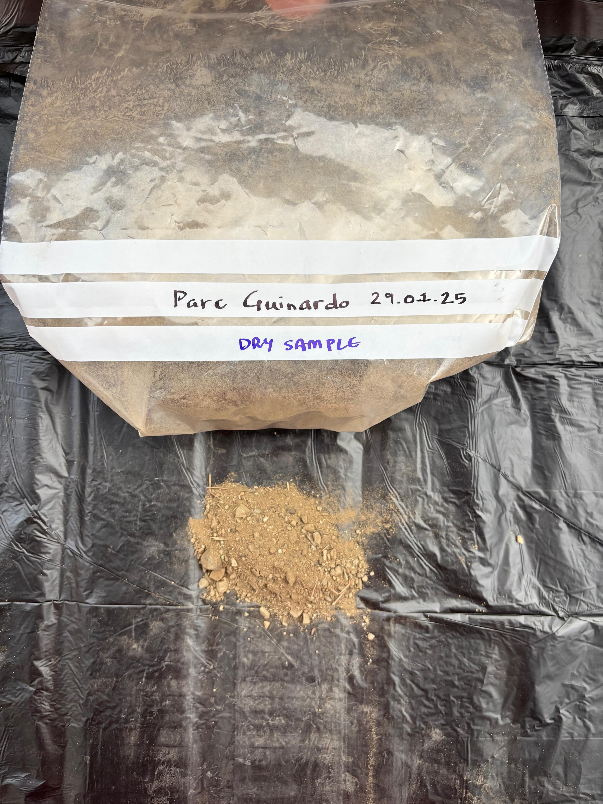

# Intervention 01 : Harvesting Clay

As my first intervention, i decided to go around Barcelona to harvest wild clay. The intention of this intervention was to learn where clay as a material comes from and identifying which soil could be processed to make clay.&#x20;



Another sub intention was to ground myself in the context of Barcelona, which I wasnt able to do in the first term. So after reaching out to multiple people via email to discuss about heritage and clay, I decided to go out and harvest wild clay. It seemed fitting for me to understand about the origin and history of the material that I'm interested in researching about. After doing some studying about how and where to find clay, I decided to go to three locations -

1. Parc del Guinardo&#x20;
2. Parc de la Collserola
3. El Part de Llobregat&#x20;

Each place has a distinct landscape, with completely different conditions, so the possibilities of finding variations was higher. I collected one sample from Guinardo, four from Collserola and one from El Prat.&#x20;

<figure><figcaption>
Collected Samples
</figcaption></figure>

As suggested by Jonathan, Collserola was a super exciting site. On the route between Leka and Can Sarda restaurants, I managed to find five samples of varying textures and colours. The places closer to Leka has very dry, gravel like soil. But as we moved closer to Can Sarda, the ground changed to become much more moist, and the road cut walls exposed beautiful red clay.

<figure><figcaption>
Red clay exposed by roadcut 
</figcaption></figure>

<figure><figcaption></figcaption></figure> <figure><figcaption></figcaption></figure> <figure><figcaption></figcaption></figure>

<figure><figcaption></figcaption></figure> <figure><figcaption></figcaption></figure> <figure><figcaption></figcaption></figure>

After getting the samples, the next step is to process it. Using a method called 'Levigation', I processed some samples, set them aside to let the clay settle. Stay tuned for the results!&#x20;

<figure><figcaption>
Clay will settle down, after which the drying process can start
</figcaption></figure>

